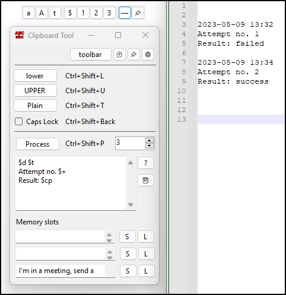

# Clipboard tool
*by Andreas Aakvik Gogstad*  
*2022*

Source code:
https://github.com/snjo/ClipboardTool

-----------------------------------------
## Variables for text processing:

|Variables|Function                                       |
|---------|-----------------------------------------------|
|$d       |date                                           |
|$t       |time                                           |
|$cp	  |clipboard contents                             |
|$cl / $cu|clipboard in lower/upper case                  |
|$i       |number                                         |
|$+       |number, then increment it                      |
|$-       |number, then decrement it                      |
|$n2, $n3 |use 1-3 digits in number (01, 001)             |
|$1 - $3  |contents of the memory slots                   |
|$eq      |Convert \"\" to \", and removes single \"      |
|$v       |Split value in slot 1 with ;, output value[number] |
|$list    |Split lines in main textbox (skips line 1), output value[number] |

-----------------------------------------
## Text Files in the program folder

|Text file		|Function	|Comment	|
|---|---|---|
|process.txt		|Preset contents of the Proccess text area (The main text box in the application).|You can update the text file by using the Save button next to the textbox (diskette icon)|
|mem1.txt-mem3.txt	|Preset contents of the three memory slots at the bottom of the applications.|			Use this for commonly typed phrases, or as part of the variables in the process text field.			The text file is not overwritten by the program when you update these fields|

-----------------------------------------
## Hotkeys

|Function                       |Default hotkey         |
|-------------------------------|-----------------------|
|Convert to upper case		|Ctrl+Shift+U		|
|Convert to lower case		|Ctrl+Shift+D		|
|Convert to plain text		|Ctrl+Shift+T		|
|Process text using $'s		|Ctrl+Shift+P		|
|Caps Lock toggle		|Ctrl+Shift+Backspace	|
|Date/Time			|Ctrl+Shift+D		|

	Tap the date hotkey 1-3 times while holding the modifier keys:
	1: Types out just the date
	2: Types out the Date and Time
	3: Types out just the Time

-----------------------------------------
## Key codes for hotkey options:
https://learn.microsoft.com/en-us/dotnet/api/system.windows.forms.keys?view=windowsdesktop-7.0

|Key|Keycode|
|---|-------|
|0-9|0 to 9|
|A-Z|A to Z|
|F1-F24|F1 to F24|
|The BACKSPACE key|Back|
|The TAB key|Tab|
|The RETURN key|Return|
|The ENTER key|Enter|
|The PAUSE key|Pause|
|The CAPS LOCK key|CapsLock|
|The ESC key|Escape|
|The SPACEBAR key|Space|
|The PAGE UP key|PageUp|
|The PAGE DOWN key|PageDown|
|The END key|End|
|The HOME key|Home|
|The LEFT ARROW key|Left|
|The UP ARROW key|Up|
|The RIGHT ARROW key|Right|
|The DOWN ARROW key|Down|
|The PRINT SCREEN key|PrintScreen|
|The INS key|Insert|
|The DEL key|Delete|
|The left Windows logo key|LWin|
|The right Windows logo key|RWin|
|The 0 key on the numeric keypad|NumPad0|
|The 1 key on the numeric keypad|NumPad1|
|The 2 key on the numeric keypad|NumPad2|
|The 3 key on the numeric keypad|NumPad3|
|The 4 key on the numeric keypad|NumPad4|
|The 5 key on the numeric keypad|NumPad5|
|The 6 key on the numeric keypad|NumPad6|
|The 7 key on the numeric keypad|NumPad7|
|The 8 key on the numeric keypad|NumPad8|
|The 9 key on the numeric keypad|NumPad9|
|The Multiply key|Multiply|
|The Add key|Add|
|The Separator key|Separator|
|The Subtract key|Subtract|
|The Decimal key|Decimal|
|The Divide key|Divide|
|The NUM LOCK key|NumLock|
|The SCROLL LOCK key|Scroll|
|The OEM angle bracket or backslash key on the RT 102 key keyboard|OemBackslash|
|The OEM close bracket key on a US standard keyboard|OemCloseBrackets|
|The OEM comma key on any country/region keyboard|Oemcomma|
|The OEM minus key on any country/region keyboard|OemMinus|
|The OEM open bracket key on a US standard keyboard|OemOpenBrackets|
|The OEM period key on any country/egion keyboard|OemPeriod|
|The OEM pipe key on a US standard keyboard|OemPipe|
|The OEM plus key on any country/region keyboard|Oemplus|
|The OEM question mark key on a US standard keyboard|OemQuestion|
|The OEM singled/double quote key on a US standard keyboard|OemQuotes|
|The OEM Semicolon key on a US standard keyboard|OemSemicolon|
|The OEM tilde key on a US standard keyboard|Oemtilde|