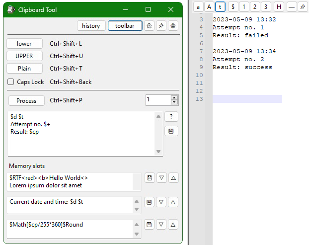

<!-- This file is formatted with Markdown. While it's readable as plain text, some characters have a backslash \ escape character in front of them, these should be ignored-->
<!-- For best readability, view it at https://github.com/snjo/ClipboardTool-->
# Clipboard tool
*by Andreas Aakvik Gogstad*  
*2022*

Source code:
https://github.com/snjo/ClipboardTool

-----------------------------------------
## Commands for text processing:

| Command   | Function                                                         |
|-----------|------------------------------------------------------------------|
| $d        | date                                                             |
| $t        | time                                                             |
| $cp       | clipboard contents                                               |
| $cl / $cu | clipboard in lower/upper case                                    |
| $i        | number                                                           |
| $+        | number, then increment it                                        |
| $-        | number, then decrement it                                        |
| $n2, $n3  | use 1-3 digits in number (01, 001)                               |
| $m1 - $m3 | contents of the memory slots                                     |
| $eq       | Convert \"\" to \", and removes single \"                        |
| $rep      | Replace text in clipboard. Use mem slot 1 & 2 as from/to strings |
| $vcm      | Split value in slot 1 with comma, output value[number]           |
| $vsc      | Split value in slot 1 with semicolon, output value[number]       |
| $vsp      | Split value in slot 1 with space, output value[number]           |
| $list     | Split lines in main textbox (skips line 1), output value[number] |
| $prompt   | Opens a popup box to insert a text value                         |
| $RTF      | Output Rich text. See details below                              |

-----------------------------------------
## Text Files in the program folder

By default the program looks for these files in the local folder. You can direct it to another folder on your PC it the Settings panel.
If you placed this program in one of the write protected Program Files folders, you should point the text file location elsewhere.

| Text file              | Function                                                                          | Comment	                                                                                   |
|------------------------|-----------------------------------------------------------------------------------|---------------------------------------------------------------------------------------------|
| process.txt            | Preset contents of the Proccess text area (The main text box in the application). | You can update the text file by using the Save button next to the textbox (diskette icon)   |
| mem1.txt-mem3.txt      | Preset contents of the three memory slots at the bottom of the applications.      | Use this for commonly typed phrases, or as part of the commands in the process text field. The text file is only overwritten by the program if configured in the settings |

-----------------------------------------
## Hotkeys

The program settings user.config are stored in a folder in %localappdata%\ClipboardTool\

| Function                       | Default hotkey         |
|--------------------------------|------------------------|
| Convert to upper case          | Ctrl+Shift+U           |
| Convert to lower case          | Ctrl+Shift+D           |
| Convert to plain text          | Ctrl+Shift+T           |
| Process text using $'s         | Ctrl+Shift+P           |
| Caps Lock toggle               | Ctrl+Shift+Backspace   |
| Memory Slot 1                  | Ctrl+Shift+1           |
| Memory Slot 2                  | Ctrl+Shift+2           |
| Memory Slot 3                  | Ctrl+Shift+3           |
| Reset Number UpDown to 1       | Ctrl+Shift+R           |
| Date/Time                      | Ctrl+Shift+D           |
| History/Saved Text Window      | Ctrl+Shift+H           |

Tap the date hotkey 1-3 times while holding the modifier keys:

	1: Types out just the date	
	2: Types out just the Time
	3: Types out the Date and Time

Memory Slot hotkeys also does any $ processing in the field, but some functions are not suited for these slots since they rely on values in the mem slots ($rep, $vcm, $list etc.)

-----------------------------------------
## History Window

The History window allows you to save text and quickly load them into the clipboard. Any $ commands in the text will be processed if you use the [>] Copy button.

Set the folder for these text files in Options, or allow the program to create the folder for you when opening History the first time.

The Minimize on Copy checkbox default setting can be saved in Options.

If you pin an entry, the file will be saved. Unpinning the entry will delete the file. Any entries that are not pinned (saved) will be lost if you close the History window.

When adding a new entry from clipboard using the Add button, or pinning a manually created entry, you must specify a title. This title will be used as the file name (.txt will be added automatically)
If you have selected a color, the text file will begin with a color tag on the first line.

#### Quick Tip
Set the History hotkey to a convenient key like F2 (without modifiers), and set the "Minimize after copy" on in options.

Then while working in an application, you can press the hotkey, copy the text, and paste into your application.

-----------------------------------------

## Rich Text (RTF) output

If you add the $RFT command, the text will be output to the clipboard in Rich Text format, allowing for text styles, colors and font families.

Outputting this correctly requires using the clipboard. Set Options to use Ctrl+V instead of Send Keys. While using Send Keys option, the output will be in plain text.

Text can be marked up using either RTF codes such as "\b ", "\b0 " and more advanced codes, or using a small set of predefined tags.
These tags will self terminate when reaching the next tag, making them slightly easier to use than normal RTF codes.

Any Backslashes ( \ ) in RTF text will be intercepted as an RTF code. Use a double backslash to represent a backslash that should be output.
\\\\ = \\ 
<!-- If you're reading this as plain text: \\ = \ -->

| Tag                     | Effect                   |
|-------------------------|--------------------------|
| \<>                     | End previous tag         |
| \<b>                    | Bold                     |
| \<i>                    | Italic                   |
| \<plain>                | Plain text               |
| \<strike>               | Strikethrough            |
| \<ul>                   | Underline                |
| \<ulw>                  | Underline just words     |
| \<default>              | Font 0 Default           |
| \<serif>                | Font 1 Serif             |
| \<sans>                 | Font 2 Sans Serif        |
| \<mono>                 | Font 3 Monospace         |
| \<script>               | Font 4 Script            |
| \<decor>                | Font 5 Decorative        |
| \<fs**>                 | Size in half-points      |
|                         | Ex: £\<fs18> = 9 point   |
| \<cf*>                  | Color, see Colors section|
| \<red> \<black> etc.    | Predefined colors        |
| \<[RTF code without]>   | Ex: \<nl> = \\nl         |

When using normal RTF codes with a backslash, you must leave a space or other separator at the end of the tag.

*Example: "hello \\b world\\b0 " is OK, "hello \\bworld\\b0" is not.*
<!-- If you're reading this as plain text, ignore \ before tags. Use <>, not \<> -->

-----------------------------------------
### Colored text

Some colors are predefined as tags:
\<black>, \<white>, \<gray>, \<red>, \<green>, \<blue>

You can add more colors in Options in this format:
\\red0\\green80\\blue180;\\red255\\green0\\blue180;

You can reference these color values starting with number 7: \<cf7> or \\cf7
(The first six values are reserved by the predefined colors)

-----------------------------------------
### Font table

The font table can be customized in Options. When using values outside the predefined font tags, use RTF commands.

Example: \<f6> or \\f6  to use

-----------------------------------------
## Key codes for hotkey options:
https://learn.microsoft.com/en-us/dotnet/api/system.windows.forms.keys?view=windowsdesktop-7.0

| Key                              | Keycode             |
|----------------------------------|---------------------|
| 0-9                              | 0 to 9              |
| A-Z                              | A to Z              |
| F1-F24                           | F1 to F24           |
| The BACKSPACE key                | Back                |
| The TAB key                      | Tab                 |
| The RETURN key                   | Return              |
| The ENTER key                    | Enter               |
| The PAUSE key                    | Pause               |
| The CAPS LOCK key                | CapsLock            |
| The ESC key                      | Escape              |
| The SPACEBAR key                 | Space               |
| The PAGE UP key                  | PageUp              |
| The PAGE DOWN key                | PageDown            |
| The END key                      | End                 |
| The HOME key                     | Home                |
| The LEFT ARROW key               | Left                |
| The UP ARROW key                 | Up                  |
| The RIGHT ARROW key              | Right               |
| The DOWN ARROW key               | Down                |
| The PRINT SCREEN key             | PrintScreen         |
| The INS key                      | Insert              |
| The DEL key                      | Delete              |
| The left Windows logo key        | LWin                |
| The right Windows logo key       | RWin                |
| The 0 key on the numeric keypad  | NumPad0             |
| The 1 key on the numeric keypad  | NumPad1             |
| The 2 key on the numeric keypad  | NumPad2             |
| The 3 key on the numeric keypad  | NumPad3             |
| The 4 key on the numeric keypad  | NumPad4             |
| The 5 key on the numeric keypad  | NumPad5             |
| The 6 key on the numeric keypad  | NumPad6             |
| The 7 key on the numeric keypad  | NumPad7             |
| The 8 key on the numeric keypad  | NumPad8             |
| The 9 key on the numeric keypad  | NumPad9             |
| The Multiply key                 | Multiply            |
| The Add key                      | Add                 |
| The Separator key                | Separator           |
| The Subtract key                 | Subtract            |
| The Decimal key                  | Decimal             |
| The Divide key                   | Divide              |
| The NUM LOCK key                 | NumLock             |
| The SCROLL LOCK key              | Scroll              |
| The OEM angle bracket or backslash key on the RT 102 key keyboard    | OemBackslash     |
| The OEM close bracket key on a US standard keyboard                  | OemCloseBrackets |
| The OEM comma key on any country/region keyboard                     | Oemcomma         |
| The OEM minus key on any country/region keyboard                     | OemMinus         |
| The OEM open bracket key on a US standard keyboard                   | OemOpenBrackets  |
| The OEM period key on any country/egion keyboard                     | OemPeriod        |
| The OEM pipe key on a US standard keyboard                           | OemPipe          |
| The OEM plus key on any country/region keyboard                      | Oemplus          |
| The OEM question mark key on a US standard keyboard                  | OemQuestion      |
| The OEM singled/double quote key on a US standard keyboard           | OemQuotes        |
| The OEM Semicolon key on a US standard keyboard                      | OemSemicolon     |
| The OEM tilde key on a US standard keyboard                          | Oemtilde         |